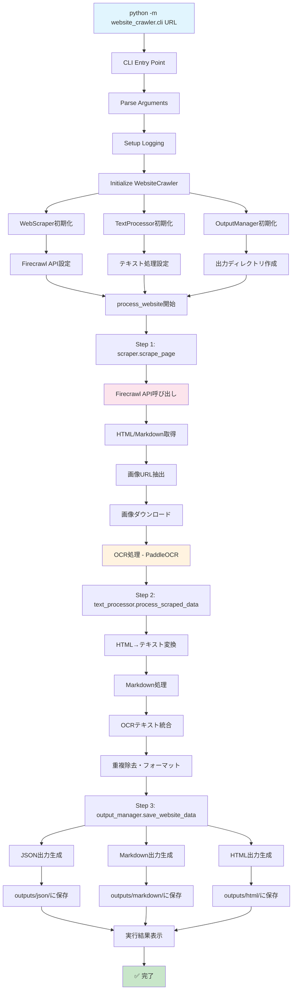

# Firecrawl Website Crawler

Modern web scraping with OCR support using Firecrawl API

## 🚀 Overview

A comprehensive website crawler that extracts content from web pages using the Firecrawl API, with advanced OCR capabilities for image text extraction. Outputs structured data in multiple formats for various use cases.

## ✨ Features

### 📊 Comprehensive Data Extraction
- **HTML Content**: Clean, structured HTML extraction
- **Markdown Conversion**: Formatted markdown output
- **Structured Data**: News, events, contact information extraction
- **OCR Processing**: Text extraction from images with confidence scoring

### 🔄 Multi-Page Crawling
- **Sitemap Discovery**: Automatic sitemap.xml detection and parsing
- **Link Following**: Intelligent link discovery and filtering
- **Depth Control**: Configurable crawling depth (1-5 levels)
- **Smart Filtering**: Exclude admin pages, downloads, and irrelevant content
- **Site Structure Analysis**: Complete website mapping and reporting

### 📁 Multiple Output Formats
- **JSON**: Complete data structure with metadata
- **HTML**: Beautiful, formatted web pages
- **Markdown**: Clean text format for documentation
- **CSV**: Structured data in spreadsheet format
- **Site Reports**: Comprehensive website structure analysis

### 🖼️ Advanced Image Processing
- Automatic image download and processing
- PaddleOCR integration for high-accuracy text extraction
- Vertical text support (Japanese, Chinese, etc.)
- Confidence scoring for extracted text
- Optional AWS S3 integration

### ⚡ Efficient Processing
- **Concurrent Crawling**: Multi-threaded processing for speed
- **Progress Tracking**: Real-time progress display
- **Error Recovery**: Robust error handling and retry logic
- **Rate Limiting**: Configurable delays to respect server limits
- **Batch Processing**: Process multiple URLs or entire websites

## 📋 Requirements

- Python 3.8+
- Firecrawl API key
- PaddleOCR (for image text extraction)

## 🛠️ Installation

1. **Clone the repository**
   ```bash
   git clone <repository-url>
   cd firecrawl-website-crawler
   ```

2. **Install dependencies**
   ```bash
   pip install -r requirements.txt
   ```

3. **Configure environment**
   ```bash
   cp .env.example .env
   # Edit .env file to add your Firecrawl API key
   ```

## 📖 Usage

### Command Line Interface

#### Single Page Mode
```bash
# Process a single website
python -m website_crawler.cli https://example.com

# Process multiple websites
python -m website_crawler.cli https://site1.com https://site2.com

# Custom output directory
python -m website_crawler.cli https://example.com --output-dir custom_output

# Disable OCR for faster processing
python -m website_crawler.cli https://example.com --no-ocr

# Verbose logging
python -m website_crawler.cli https://example.com --verbose
```

#### Multi-Page Crawling Mode
```bash
# Basic multi-page crawling
python -m website_crawler.cli https://example.com --multi-page

# Advanced multi-page crawling with custom settings
python -m website_crawler.cli https://example.com --multi-page \
  --max-urls 100 \
  --max-depth 3 \
  --max-workers 5 \
  --delay 0.5

# Fast multi-page crawling without OCR
python -m website_crawler.cli https://example.com --multi-page --no-ocr

# Multi-page crawling without sitemap discovery
python -m website_crawler.cli https://example.com --multi-page --no-sitemap
```

### Python API

```python
from website_crawler.cli import WebsiteCrawler

# Initialize crawler
crawler = WebsiteCrawler(
    output_dir="outputs",
    enable_ocr=True
)

# Process single website
result = crawler.process_website("https://example.com")

if result['status'] == 'success':
    print(f"Title: {result['title']}")
    print(f"Text length: {result['text_length']:,} characters")
    print(f"Images processed: {result['image_count']}")
```

### Using as a Package

```bash
# Install in development mode
pip install -e .

# Use the CLI command
website-crawler https://example.com
```

## 📂 Project Structure

```
website-crawler/
├── website_crawler/        # Main package
│   ├── cli.py             # Command-line interface
│   ├── config.py          # Configuration management
│   ├── core/              # Core functionality
│   │   ├── scraper.py     # Web scraping
│   │   ├── processor.py   # Text processing
│   │   └── ocr.py         # Image OCR processing
│   ├── models/            # Data models
│   │   ├── data_models.py # Pydantic models
│   │   └── schemas.py     # API schemas
│   ├── outputs/           # Output management
│   │   └── managers.py    # File output handlers
│   └── utils/             # Utilities
│       └── logging.py     # Logging setup
├── examples/              # Usage examples
├── tests/                 # Test files
└── docs/                  # Documentation
```

## 🔧 Configuration

### Environment Variables

```bash
# Required
FIRECRAWL_API_KEY=your_api_key_here

# Optional
LOG_LEVEL=INFO
ENABLE_OCR=true
OCR_CONFIDENCE_THRESHOLD=0.7
DEFAULT_OUTPUT_DIR=outputs
```

### Command Line Options

- `--output-dir`: Specify output directory
- `--filename`: Custom filename (single URL only)
- `--no-ocr`: Disable OCR processing
- `--verbose, -v`: Enable verbose logging
- `--log-file`: Specify log file path

## 📊 Output Examples

### JSON Structure
```json
{
  "metadata": {
    "url": "https://example.com",
    "title": "Example Site",
    "scraped_at": "2024-01-01T12:00:00",
    "total_text_length": 15420,
    "image_count": 5
  },
  "content": {
    "combined_text": "Integrated text content...",
    "html_content": "Raw HTML content...",
    "markdown_content": "Markdown formatted content...",
    "structured_data": {...},
    "ocr_data": [...]
  }
}
```

### CSV Output (Structured Data)
| Category | Title | Date | URL | Content | Additional |
|----------|-------|------|-----|---------|------------|
| News | Latest Update | 2024-01-01 | https://... | Content description | |
| Event | Workshop | 2024-01-15 | | Event details | Location: Room A |

## 🔄 Execution Flow

### System Architecture



### 📋 Detailed Execution Flow

#### 1. **初期化フェーズ**
```
CLI起動 → 引数解析 → ログ設定 → コンポーネント初期化
├── WebScraper (Firecrawl API + OCR)
├── TextProcessor (テキスト統合処理)
└── OutputManager (ファイル出力管理)
```

#### 2. **データ収集フェーズ**
```
scraper.scrape_page(url)
├── Firecrawl API呼び出し
├── HTML/Markdownコンテンツ取得
├── 画像URL抽出・ダウンロード
└── PaddleOCRで画像→テキスト変換
```

#### 3. **データ処理フェーズ**
```
text_processor.process_scraped_data()
├── HTMLからプレーンテキスト抽出
├── Markdownコンテンツ処理
├── OCRテキストと統合
└── 重複除去・フォーマット整形
```

#### 4. **出力生成フェーズ**
```
output_manager.save_website_data()
├── JSON形式 (構造化データ)
├── Markdown形式 (文書形式)
└── HTML形式 (Web表示用)
```

#### 5. **ファイル構造**
```
outputs/
├── json/           # 構造化データ
├── markdown/       # テキスト文書
├── html/          # Web表示用
└── structured/    # CSV等(バッチ処理時)

downloaded_images/  # OCR用画像ファイル
```

### ⚙️ 主要コンポーネント

| コンポーネント | 役割 | 主要技術 |
|---|---|---|
| **WebScraper** | Web内容取得・OCR | Firecrawl API, PaddleOCR |
| **TextProcessor** | テキスト統合処理 | BeautifulSoup, 正規表現 |
| **OutputManager** | マルチ形式出力 | JSON, HTML, Markdown |
| **CLI** | ユーザーインターフェース | argparse, logging |

### 🔄 データフロー
```
URL → Firecrawl → HTML/MD → 画像抽出 → OCR → テキスト統合 → 出力ファイル
```

### 📊 処理時間の目安
- **小規模サイト** (～10画像): 30秒～1分
- **中規模サイト** (10～50画像): 1～3分  
- **大規模サイト** (50+画像): 3分以上

OCR処理が時間の大部分を占めるため、高速処理には `--no-ocr` オプションを使用してください。

## 🔍 Development

### Run Examples

```bash
# Basic usage
python examples/basic_usage.py

# Batch processing
python examples/batch_processing.py
```

### Install Development Dependencies

```bash
pip install -e ".[dev]"
```

### Code Formatting

```bash
# Format code
black website_crawler/
isort website_crawler/

# Type checking
mypy website_crawler/
```

## 🐛 Troubleshooting

### Common Issues

1. **API Key Error**
   ```
   ValueError: FIRECRAWL_API_KEY environment variable is required
   ```
   Solution: Set your API key in `.env` file

2. **OCR Library Error**
   ```
   ImportError: No module named 'paddleocr'
   ```
   Solution: `pip install paddleocr`

3. **Memory Issues**
   ```
   MemoryError: Unable to allocate array
   ```
   Solution: Use `--no-ocr` flag to disable OCR processing

### Log Files

Check `website_crawler.log` for detailed error information and processing logs.

## 📄 License

This project is licensed under the MIT License - see the [LICENSE](LICENSE) file for details.

## 🤝 Contributing

1. Fork the repository
2. Create a feature branch (`git checkout -b feature/amazing-feature`)
3. Commit your changes (`git commit -m 'Add amazing feature'`)
4. Push to the branch (`git push origin feature/amazing-feature`)
5. Open a Pull Request

## 📞 Support

- 🐛 **Issues**: [GitHub Issues](https://github.com/your-org/firecrawl-website-crawler/issues)
- 📧 **Email**: support@example.com
- 📖 **Documentation**: [Wiki](https://github.com/your-org/firecrawl-website-crawler/wiki)

## 🏷️ Version History

- **v1.0.0**: Initial release with full refactoring
  - Modern package structure
  - CLI interface
  - Multiple output formats
  - OCR integration