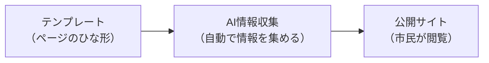
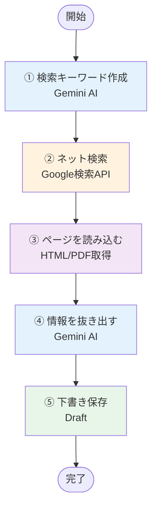
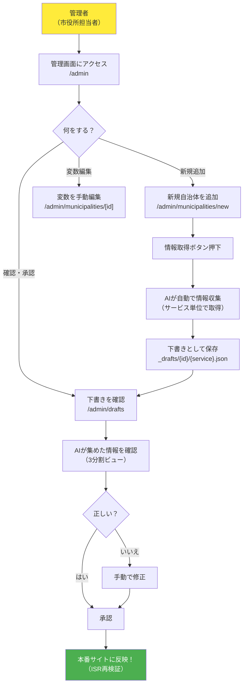
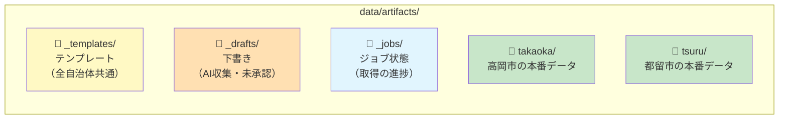
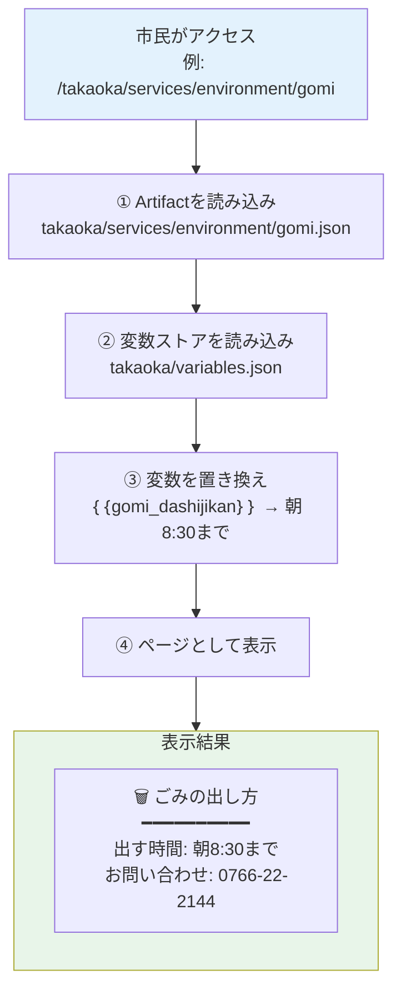
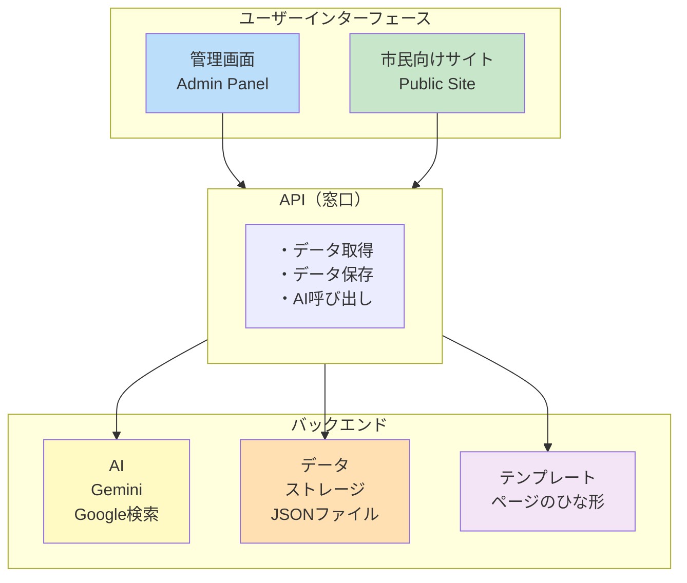
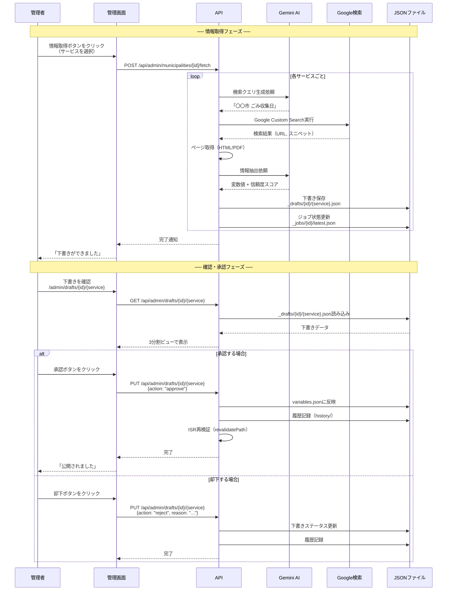

# INNOMA システムフローチャート

**最終更新**: 2026-01-29

非プログラマー向けのシステム概要図です。Mermaid記法で記述しています。

---

## 1. システム全体図



**INNOMAとは**: 自治体のWebサイトを自動的に作成・更新するシステムです。AIが自治体の情報（電話番号、住所、手続き方法など）をインターネットから自動で集めてきて、統一されたデザインのWebサイトを作ります。

---

## 1.1 用語説明

### システム全体の用語

| 用語 | 説明 | 例 |
|------|------|-----|
| **テンプレート** | 全自治体共通のページのひな形。変数（`{{変数名}}`）が埋め込まれている | `_templates/services/environment/gomi.json` |
| **Artifact** | 各自治体のページデータ（テンプレートから複製されたもの） | `takaoka/services/environment/gomi.json` |
| **変数（Variable）** | 自治体ごとに異なる情報を入れる場所 | `{{city_hall_phone}}` → `0766-20-1234` |
| **下書き（Draft）** | AIが収集した情報の一時保存。承認後に`variables.json`に反映 | `_drafts/takaoka/environment.json` |

### 市民向けサイト（`/[自治体ID]/*`）の用語

| 用語 | 説明 | パス例 |
|------|------|--------|
| **自治体トップ** | 自治体のトップページ。大カテゴリ（トピック）の一覧を表示 | `/takaoka/` |
| **トピック一覧** | 大カテゴリ一覧ページ（自治体トップと同様の内容） | `/takaoka/topics` |
| **トピックページ** | 大カテゴリ内のサービス一覧ページ | `/takaoka/topics/environment` |
| **サービスページ** | 具体的な手続き・サービスの詳細ページ | `/takaoka/services/environment/gomi` |

### 管理画面（`/admin/*`）の用語

| 用語 | 説明 | パス例 |
|------|------|--------|
| **ダッシュボード** | 管理画面のトップ。自治体一覧と通知を表示 | `/admin` |
| **自治体一覧** | 登録されている自治体の一覧 | `/admin/municipalities` |
| **自治体詳細** | 特定自治体の変数編集・情報取得画面 | `/admin/municipalities/takaoka` |
| **下書き一覧** | 承認待ちの下書き一覧 | `/admin/drafts` |
| **下書き詳細** | 下書きの確認・承認画面（3分割ビュー） | `/admin/drafts/takaoka/environment` |
| **通知一覧** | システム通知の一覧 | `/admin/notifications` |

### 市民向けサイトのページ階層図

```
/takaoka/                       自治体トップ（大カテゴリ一覧）
├── /takaoka/topics             トピック一覧（大カテゴリ一覧）
│   ├── /takaoka/topics/environment     トピックページ（環境・ごみカテゴリのサービス一覧）
│   ├── /takaoka/topics/childcare       トピックページ（子育てカテゴリのサービス一覧）
│   └── ...
└── /takaoka/services           サービスページ群
    ├── /takaoka/services/environment/gomi      サービスページ（ごみの出し方）
    ├── /takaoka/services/childcare/nursery     サービスページ（保育所）
    └── ...
```

---

## 2. AI情報収集の流れ



### 各ステップの説明

| ステップ | 処理内容 | 使用技術 |
|---------|---------|---------|
| ① | AIが検索キーワードを考える | Gemini AI |
| ② | Google検索で関連ページを探す | Google Custom Search API |
| ③ | 見つかったページの内容を取得（PDFも画像認識で読み取り） | HTML Parser / Vision API |
| ④ | AIが必要な情報を抽出 | Gemini AI |
| ⑤ | 人間がチェックするまで一時保存 | JSON ファイル |

---

## 3. 管理者の作業フロー



**注意**: 現在は認証機能なし（開発中）。将来的にVercel Password Protection等を導入予定。

---

## 4. データの保存場所



**注意**: ディレクトリ名は日本語名ではなく、英語ID（`takaoka`, `tsuru`等）を使用します。

### ディレクトリ構造

```
data/artifacts/
├── _templates/            ← テンプレート（全自治体共通のひな形）
│   ├── index.json         ← トップページテンプレート
│   ├── topics.json        ← トピック一覧
│   ├── topics/            ← トピックページ（カテゴリ別）
│   │   ├── environment.json
│   │   ├── childcare.json
│   │   └── ...
│   └── services/          ← サービスページ（具体的な手続き）
│       ├── environment/
│       │   └── gomi.json
│       ├── childcare/
│       │   ├── nursery.json
│       │   └── boshi.json
│       └── ...
├── _drafts/               ← 下書き（AIが集めた未承認の変数）
│   └── takaoka/           ← 自治体ID（英語）
│       ├── environment.json  ← サービス単位で保存
│       ├── childcare.json
│       └── ...
├── _jobs/                 ← ジョブ状態（取得の進捗管理）
│   └── takaoka/
│       └── latest.json
├── takaoka/               ← 高岡市の本番データ
│   ├── meta.json          ← 自治体メタデータ
│   ├── variables.json     ← 変数値ストア（全変数の現在値）
│   ├── districts.json     ← 地区情報（オプション）
│   ├── history/           ← 編集履歴
│   │   └── 2026-01.json
│   ├── index.json         ← トップページ
│   ├── topics.json        ← トピック一覧
│   ├── topics/            ← トピックページ
│   └── services/          ← サービスページ
└── tsuru/                 ← 都留市の本番データ
    └── ...
```

### ファイルの役割

| ファイル | 説明 |
|---------|------|
| `meta.json` | 自治体の基本情報（名前、公式URL、ステータス等） |
| `variables.json` | 全変数の現在値（電話番号、料金、URLなど） |
| `index.json` | 自治体トップページのコンテンツ |
| `topics.json` | トピック（カテゴリ）一覧 |
| `topics/*.json` | 各トピックページ |
| `services/**/*.json` | 各サービスページ |

---

## 5. 市民がページを見るまでの流れ



### 変数置換の仕組み

1. **Artifactの読み込み**: 自治体IDとパスからJSONファイルを特定
2. **変数ストアの読み込み**: `variables.json`から変数名→値のマッピングを取得
3. **変数の置換**: `{{variable_name}}`形式の文字列を実際の値に置換
4. **未置換変数の処理**: 値がない変数は空白のまま表示（または警告）

---

## 6. 主要な部品の関係



---

## 7. 下書き承認フロー（詳細）



### 下書きのデータ構造

下書きには以下の情報が含まれます：

| フィールド | 説明 |
|-----------|------|
| `variables` | 取得できた変数（値、ソースURL、信頼度、検証結果） |
| `missingVariables` | 取得できなかった変数の一覧 |
| `searchAttempts` | 未取得変数の検索試行履歴（デバッグ用） |
| `status` | draft / pending_review / approved / rejected |
| `metadata` | 取得ジョブID、承認者、承認日時など |

---

## 8. 部品の役割まとめ

```mermaid
mindmap
    root((INNOMA))
        テンプレート
            ページの骨格
            全自治体で共通
            _templates/に保存
        Artifact
            自治体別のページデータ
            テンプレートから複製
            {自治体ID}/に保存
        変数
            自治体ごとに変わる情報
            電話番号、住所、曜日など
            variables.jsonに保存
        AI Gemini
            情報を探す
            情報を整理する
            調査員的存在
        下書き
            AIが見つけた情報
            チェック待ちの書類
            _drafts/に保存
        管理画面
            人間が確認・承認
            事務所的存在
        公開サイト
            市民が見るページ
            窓口的存在
```

---

## 部品の役割一覧表

| 部品 | 役割 | 例え | 保存場所 |
|------|------|------|---------|
| **テンプレート** | ページの骨格（全自治体共通） | 履歴書のフォーマット | `_templates/` |
| **Artifact** | 自治体別のページデータ | 記入済みの履歴書 | `{自治体ID}/` |
| **変数** | 自治体ごとに変わる情報 | 名前や住所を書く欄 | `variables.json` |
| **AI（Gemini）** | 情報を探して整理 | 調査員 | - |
| **下書き** | AIが見つけた情報の一時保管 | チェック待ちの書類 | `_drafts/` |
| **管理画面** | 人間が確認・承認する場所 | 事務所 | `/admin/*` |
| **公開サイト** | 市民が見るページ | 窓口 | `/[municipality]/*` |

---

## まとめ

**INNOMAは、AIが自治体の情報を自動で集め、人間がチェックして承認し、市民に公開する一連の流れを効率化するシステムです。**

---

## 表示方法

このドキュメントのMermaid図は以下の環境で表示できます：

- GitHub（自動レンダリング）
- VS Code（Mermaid拡張機能）
- Notion（/mermaid ブロック）
- Obsidian（標準対応）
- その他Mermaid対応エディタ
