# INNOMA タクソノミー・URL・ディレクトリ構造一覧

> **自動生成ファイル**: このファイルは `npm run generate:taxonomy` で自動更新されます。
> 手動編集しないでください。

**最終更新**: 2026-02-04T23:47:40.212Z

## 概要

| 項目 | 数 |
|------|-----|
| カテゴリ数 | 15 |
| Content Item数 | 38 |
| Topic数 | 7 |
| 総ページ数 | 45 |

---

## タクソノミー構造（マーメイド）

```mermaid
graph TD
    subgraph "子育て・出産 (childcare)"
        childcare[childcare]
        childcare --> boshi[boshi]
        childcare --> jidou_teate[jidou-teate]
        childcare --> jidou_teate_apply[jidou-teate-apply]
        childcare --> jidou_teate_check[jidou-teate-check]
        childcare --> nursery[nursery]
        childcare --> nursery_apply[nursery-apply]
    end

    subgraph "防災・安全 (disaster)"
        disaster[disaster]
        disaster --> bosai_mail[bosai-mail]
        disaster --> hazard_map[hazard-map]
        disaster --> hinanjo[hinanjo]
    end

    subgraph "環境・ごみ (environment)"
        environment[environment]
        environment --> gomi[gomi]
        environment --> kaden_recycle[kaden-recycle]
        environment --> sodaigomi[sodaigomi]
    end

    subgraph "government (government)"
        government[government]
    end

    subgraph "健康・医療 (health)"
        health[health]
        health --> kokuho[kokuho]
        health --> kokuho_apply[kokuho-apply]
        health --> kokuho_check[kokuho-check]
        health --> kouki[kouki]
        health --> kouki_check[kouki-check]
        health --> yobosesshu[yobosesshu]
    end

    subgraph "住まい・土地 (housing)"
        housing[housing]
        housing --> moving_checklist[moving-checklist]
    end

    subgraph "届出・証明 (registration)"
        registration[registration]
        registration --> inkan[inkan]
        registration --> juminhyo[juminhyo]
        registration --> koseki[koseki]
        registration --> mynumber[mynumber]
        registration --> shussei[shussei]
        registration --> tenkyo[tenkyo]
        registration --> tennyu[tennyu]
        registration --> tenshutsu[tenshutsu]
    end

    subgraph "税金 (tax)"
        tax[tax]
        tax --> furusato[furusato]
        tax --> juminzei[juminzei]
        tax --> keijidosha[keijidosha]
        tax --> kotei[kotei]
        tax --> nouzei[nouzei]
        tax --> zeishoumei[zeishoumei]
    end

    subgraph "福祉・介護 (welfare)"
        welfare[welfare]
        welfare --> houkatsu[houkatsu]
        welfare --> kaigo[kaigo]
        welfare --> kaigo_apply[kaigo-apply]
        welfare --> kaigo_check[kaigo-check]
        welfare --> koureisha[koureisha]
    end

```

---

## カテゴリ別ページ一覧

### childcare (子育て・出産)

| スラッグ | ファイルパス | タイプ |
|---------|-------------|--------|
| boshi | boshi | content |
| childcare | childcare | topic |
| jidou-teate | jidou-teate | content |
| jidou-teate-apply | jidou-teate-apply | content |
| jidou-teate-check | jidou-teate-check | content |
| nursery | nursery | content |
| nursery-apply | nursery-apply | content |

### disaster (防災・安全)

| スラッグ | ファイルパス | タイプ |
|---------|-------------|--------|
| bosai-mail | bosai-mail | content |
| disaster | disaster | topic |
| hazard-map | hazard-map | content |
| hinanjo | hinanjo | content |

### environment (環境・ごみ)

| スラッグ | ファイルパス | タイプ |
|---------|-------------|--------|
| environment | environment | topic |
| gomi | gomi | content |
| kaden-recycle | kaden-recycle | content |
| sodaigomi | sodaigomi | content |

### government (government)

| スラッグ | ファイルパス | タイプ |
|---------|-------------|--------|
| contacts | contacts | topic |

### health (健康・医療)

| スラッグ | ファイルパス | タイプ |
|---------|-------------|--------|
| kokuho | kokuho | content |
| kokuho-apply | kokuho-apply | content |
| kokuho-check | kokuho-check | content |
| kouki | kouki | content |
| kouki-check | kouki-check | content |
| yobosesshu | yobosesshu | content |

### housing (住まい・土地)

| スラッグ | ファイルパス | タイプ |
|---------|-------------|--------|
| moving-checklist | moving-checklist | content |

### registration (届出・証明)

| スラッグ | ファイルパス | タイプ |
|---------|-------------|--------|
| inkan | inkan | content |
| juminhyo | juminhyo | content |
| koseki | koseki | content |
| moving | moving | topic |
| mynumber | mynumber | content |
| shussei | shussei | content |
| tenkyo | tenkyo | content |
| tennyu | tennyu | content |
| tenshutsu | tenshutsu | content |

### tax (税金)

| スラッグ | ファイルパス | タイプ |
|---------|-------------|--------|
| furusato | furusato | content |
| juminzei | juminzei | content |
| keijidosha | keijidosha | content |
| kotei | kotei | content |
| nouzei | nouzei | content |
| tax | tax | topic |
| zeishoumei | zeishoumei | content |

### welfare (福祉・介護)

| スラッグ | ファイルパス | タイプ |
|---------|-------------|--------|
| houkatsu | houkatsu | content |
| kaigo | kaigo | content |
| kaigo-apply | kaigo-apply | content |
| kaigo-check | kaigo-check | content |
| koureisha | koureisha | content |
| welfare | welfare | topic |

---

## タクソノミー定義

| カテゴリID | 日本語名 | 説明 | キーワード |
|-----------|---------|------|-----------|
| benefits | 給付・助成 | 各種給付金、助成金、年金など | 給付, 助成, 年金, 手当, 補助 |
| business | 産業・事業者 | 起業、融資、補助金、許認可、法人税など | 事業, 起業, 融資, 補助金, 法人, 許可 |
| childcare | 子育て・出産 | 妊娠、出産、子育て支援、保育所、児童手当など | 子育て, 出産, 妊娠, 保育, 児童, 子ども, 育児 |
| civic | 市民参加・行政 | 選挙、情報公開、市民相談、パブリックコメントなど | 選挙, 投票, 情報公開, 相談, 行政 |
| disaster | 防災・安全 | 防災、避難所、ハザードマップ、防犯など | 防災, 避難, 災害, ハザードマップ, 防犯, 安全 |
| driving | 自動車・運転 | 運転免許、車検、駐車場、交通安全など | 運転, 自動車, 免許, 車, 駐車, 交通 |
| employment | 就労・雇用 | 就職支援、労働相談、職業訓練、ハローワークなど | 就労, 雇用, 就職, 労働, 職業, ハローワーク |
| environment | 環境・ごみ | ごみの分別・収集、リサイクル、環境保全など | ごみ, ゴミ, 環境, リサイクル, 分別, 収集 |
| health | 健康・医療 | 国民健康保険、後期高齢者医療、健診、予防接種など | 健康, 医療, 保険, 健診, 予防接種, 国保 |
| housing | 住まい・土地 | 住宅、建築、土地、公営住宅、空き家など | 住宅, 住まい, 建築, 土地, 公営住宅, 空き家 |
| land | 農林水産 | 農業、林業、漁業、農地転用など | 農業, 林業, 漁業, 農地, 農林水産 |
| nationality | 国籍・在留 | 外国人登録、在留資格、帰化、パスポートなど | 外国人, 国籍, 在留, 帰化, パスポート, ビザ |
| registration | 届出・証明 | 戸籍、住民票、印鑑登録など各種届出・証明書 | 届出, 届, 証明, 登録, 戸籍, 住民票, 印鑑 |
| tax | 税金 | 住民税、固定資産税、納税、確定申告など | 税, 税金, 納税, 申告, 住民税, 固定資産 |
| welfare | 福祉・介護 | 高齢者福祉、介護保険、障害者支援、生活保護など | 福祉, 介護, 高齢, 障害, 障がい, 生活保護, 年金 |

---

## ソースファイル

- **page-registry.json**: `apps/web/data/artifacts/_templates/page-registry.json`
- **taxonomy-classifier.ts**: `apps/web/lib/llm/prompts/taxonomy-classifier.ts`
- **page-registry.ts**: `apps/web/lib/artifact/page-registry.ts`
