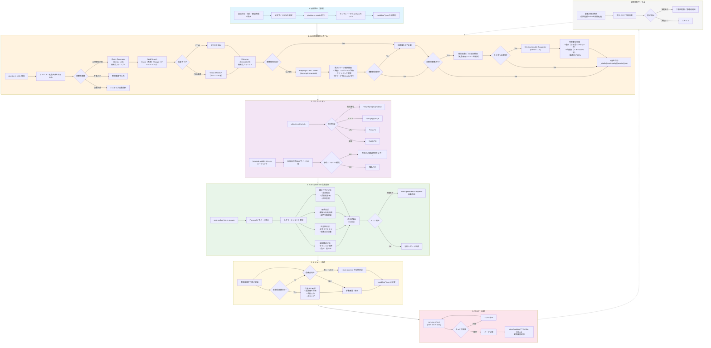
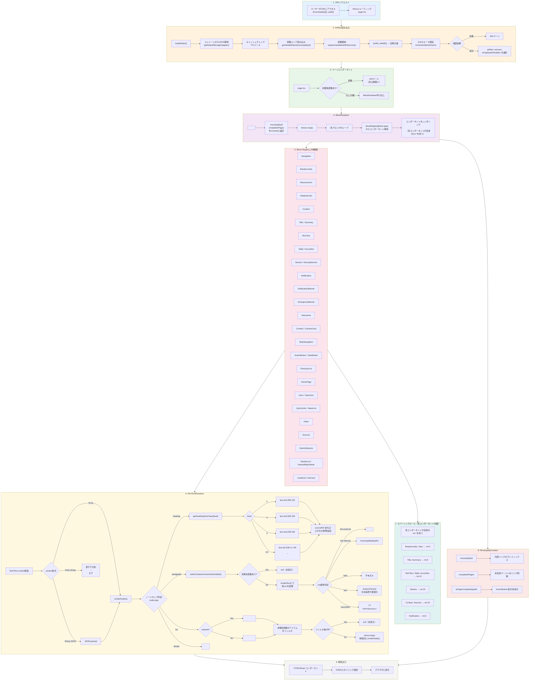
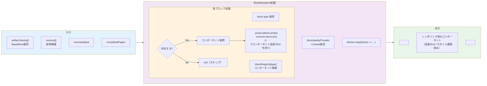

---

## ブロックレンダラー フローチャート



---

## ブロックレンダラー詳細フロー



---

## コンポーネント選択ロジック（DADS準拠）

```mermaid
flowchart TD
    A[コンテンツタイプ判定] --> B{何を表示する?}

    %% ===== ページ構造 =====
    B -->|ページタイトル| T1["Title"]
    B -->|概要・要約| T2["Summary"]
    B -->|セクション見出し| T3{レベル}
    T3 -->|h2| T3a["Section<br/>(level: 2)"]
    T3 -->|h3/h4| T3b["RichText<br/>(heading node)"]

    %% ===== ナビゲーション =====
    B -->|パンくず| N1["Breadcrumbs"]
    B -->|関連リンク| N2{表示形式}
    N2 -->|リスト| N2a["RelatedLinks"]
    N2 -->|カード| N2b["ResourceList"]
    B -->|クイックアクセス| N3["QuickLinks"]

    %% ===== 手順・フロー =====
    B -->|手順| C{ステップ数}
    C -->|3以上| C1["StepNavigation"]
    C -->|1〜2| C2["RichText<br/>(ordered list)"]
    C -->|1のみ| C3["RichText<br/>(paragraph)"]

    %% ===== リスト・データ =====
    B -->|リスト| D{データ構造}
    D -->|条件分岐あり| D1{折りたたみ必要?}
    D1 -->|Yes| D1a["Accordion"]
    D1 -->|No| D1b["Table"]
    D -->|シンプル| D2["RichText<br/>(unordered list)"]
    D -->|定義リスト| D3["DescriptionList"]

    B -->|キー・バリュー| E{値の状態}
    E -->|値あり| E1["Table"]
    E -->|値なし/空| E2["RichText<br/>(段落)"]

    B -->|Q&A・FAQ| F["Accordion"]

    %% ===== 通知・警告 =====
    B -->|重要な注意| G{重要度}
    G -->|緊急| G0["EmergencyBanner"]
    G -->|高| G1["NotificationBanner<br/>(danger)"]
    G -->|中| G2["NotificationBanner<br/>(warning)"]
    G -->|低/情報| G3["NotificationBanner<br/>(info)"]
    G -->|成功| G4["NotificationBanner<br/>(success)"]

    %% ===== 連絡先・施設 =====
    B -->|連絡先| H{件数}
    H -->|1件| H1["Contact"]
    H -->|複数| H2["DirectoryList"]

    B -->|避難所| H3["ShelterList"]
    B -->|ハザードマップ| H4["HazardMapViewer"]

    %% ===== カード・グリッド =====
    B -->|カード表示| I{用途}
    I -->|比較・詳細表示| I1["Table"]
    I -->|一覧・選択| I2{バリエーション}
    I2 -->|画像+テキスト| I2a["CardGrid<br/>(variant: media)"]
    I2 -->|リンクカード| I2b["CardGrid<br/>(variant: link)"]
    I2 -->|アイコン+説明| I2c["CardGrid<br/>(variant: info)"]
    I -->|統計・数値| I3["InfoCardGrid"]
    I -->|単体情報| I4["InfoCard"]

    %% ===== トピック・ニュース =====
    B -->|トピック一覧| K{表示形式}
    K -->|グリッド| K1["TopicGrid"]
    K -->|リスト| K2["TopicList"]

    B -->|ニュース| L{表示形式}
    L -->|一覧| L1["NewsList"]
    L -->|メタ情報| L2["NewsMeta"]

    %% ===== アクション =====
    B -->|CTAボタン| M{重要度}
    M -->|主要アクション| M1["ActionButton"]
    M -->|補助アクション| M2["TaskButton"]

    B -->|添付ファイル| M3["Attachments"]

    %% ===== 地区・変数 =====
    B -->|地区選択UI| O["DistrictSelector"]

    %% ===== テキスト・引用 =====
    B -->|本文| P["RichText"]
    B -->|引用| Q["Blockquote"]
    B -->|ステータス| R["StatusBadge"]

    %% ===== ホームページ =====
    B -->|ヒーローセクション| S["Hero"]

    %% ===== 参照 =====
    B -->|参照元・出典| J["Sources<br/>(Wikipedia形式)"]

    %% ===== スタイリング =====
    style A fill:#e3f2fd

    %% ページ構造（青系）
    style T1 fill:#bbdefb
    style T2 fill:#bbdefb
    style T3a fill:#bbdefb
    style T3b fill:#bbdefb

    %% ナビゲーション（紫系）
    style N1 fill:#e1bee7
    style N2a fill:#e1bee7
    style N2b fill:#e1bee7
    style N3 fill:#e1bee7

    %% 手順（緑系）
    style C1 fill:#c8e6c9
    style C2 fill:#c8e6c9
    style C3 fill:#c8e6c9

    %% データ（緑系）
    style D1a fill:#c8e6c9
    style D1b fill:#c8e6c9
    style D2 fill:#c8e6c9
    style D3 fill:#c8e6c9
    style E1 fill:#c8e6c9
    style E2 fill:#c8e6c9
    style F fill:#c8e6c9

    %% 通知（赤/オレンジ/青系）
    style G0 fill:#ef9a9a
    style G1 fill:#ffcdd2
    style G2 fill:#ffe0b2
    style G3 fill:#bbdefb
    style G4 fill:#c8e6c9

    %% 連絡先・施設（シアン系）
    style H1 fill:#b2ebf2
    style H2 fill:#b2ebf2
    style H3 fill:#b2ebf2
    style H4 fill:#b2ebf2

    %% カード（ピンク系）
    style I1 fill:#f8bbd9
    style I2a fill:#f8bbd9
    style I2b fill:#f8bbd9
    style I2c fill:#f8bbd9
    style I3 fill:#f8bbd9
    style I4 fill:#f8bbd9

    %% トピック・ニュース（黄系）
    style K1 fill:#fff9c4
    style K2 fill:#fff9c4
    style L1 fill:#fff9c4
    style L2 fill:#fff9c4

    %% アクション（オレンジ系）
    style M1 fill:#ffcc80
    style M2 fill:#ffcc80
    style M3 fill:#ffcc80

    %% 地区選択（茶系）
    style O fill:#d7ccc8

    %% テキスト（グレー系）
    style P fill:#cfd8dc
    style Q fill:#cfd8dc
    style R fill:#cfd8dc

    %% ホームページ（深緑系）
    style S fill:#a5d6a7

    %% 参照（グレー系）
    style J fill:#e0e0e0
```



---

## ブロックタイプ一覧（32種類）

| カテゴリ | ブロックタイプ | 用途 |
|---------|---------------|------|
| **ページ構造** | Title | ページタイトル（h1） |
| | Summary | ページ概要 |
| | Section | セクション見出し+コンテンツ |
| **ナビゲーション** | Breadcrumbs | パンくずリスト |
| | RelatedLinks | 関連リンク（シンプル） |
| | ResourceList | リソースリンク（詳細付き） |
| | QuickLinks | クイックアクセスリンク |
| **コンテンツ** | RichText | 構造化テキスト（heading/paragraph/list/divider） |
| | Table | キー・バリュー表 |
| | Accordion | 折りたたみ（Q&A、条件分岐） |
| | DescriptionList | 定義リスト（dt/dd） |
| | Blockquote | 引用 |
| | StatusBadge | ステータス表示 |
| **通知** | NotificationBanner | 注意・警告・情報（severity: info/warning/danger/success） |
| | EmergencyBanner | 緊急通知 |
| **インタラクティブ** | Contact | 連絡先（単体） |
| | DirectoryList | 施設・連絡先一覧 |
| | StepNavigation | 手順ナビゲーション |
| | ActionButton | 主要CTAボタン |
| | TaskButton | 補助アクションボタン |
| | NewsMeta | ニュースメタ情報 |
| **カード** | CardGrid | カードグリッド（media/link/info） |
| | Card | 単体カード |
| | InfoCard | 情報カード（統計・数値） |
| | InfoCardGrid | 情報カードグリッド |
| **トピック** | TopicGrid | トピックグリッド |
| | TopicList | トピックリスト |
| | NewsList | ニュース一覧 |
| **ホームページ** | Hero | ヒーローセクション |
| **地区・災害** | DistrictSelector | 地区選択UI |
| | ShelterList | 避難所リスト |
| | HazardMapViewer | ハザードマップビューア |
| **ファイル** | Attachments | 添付ファイル（PDF等） |
| **参照** | Sources | 出典・参照元（Wikipedia形式） |

---

## LLMプロンプト仕様

### Web検索APIプロバイダー

| 優先度 | プロバイダー | 無料枠 | 備考 |
|--------|-------------|--------|------|
| 推奨 | Brave Search | 2,000クエリ/月 | 日本語対応良好 |
| フォールバック | Google Custom Search | 100クエリ/日 | 最も精度が高い |

自動フォールバック: Braveで結果0件またはエラー時にGoogleに切り替え

### Query Generator（検索クエリ生成）

**入力**: 自治体名、サービス名、取得対象変数リスト

**プロンプト**（簡素化版、70%削減）:
```
${municipalityName} ${serviceName}の公式情報を検索するクエリを生成。
取得対象: ${targetInfo.join(', ')}
出力: 検索クエリのみ（1行）
```

**出力例**: `高岡市 国民健康保険 電話番号 住所 保険料 上限額 公式`

### Extractor（情報抽出）

**入力**: Webページコンテンツ、抽出対象変数リスト

**プロンプト**（簡素化版、43%削減）:
```
ページから以下を抽出しJSON出力。見つからなければnull。
- ${variableName}: ${description}
...

ページ:
${truncatedContent}
```

**出力例**:
```json
{
  "kokuho_department": "保険年金課 国保係",
  "kokuho_phone": "0766-20-1234",
  "kokuho_limit_medical": "65万円"
}
```

### プロンプト簡素化の効果

| 項目 | 検索クエリ生成 | 情報抽出 |
|-----|--------------|---------|
| プロンプト削減率 | **70%** | **43%** |
| 応答時間 | 変化なし | 変化なし |
| 品質 | 同等〜向上 | 同等 |
