# INNOMA 実装フローチャート

## 目次
1. [メインデータフロー概要](#1-メインデータフロー概要)
2. [ページレンダリングフロー](#2-ページレンダリングフロー)
3. [LLM情報取得フロー](#3-llm情報取得フロー)
4. [ドラフト管理フロー](#4-ドラフト管理フロー)
5. [テンプレート・変数システム](#5-テンプレート変数システム)
6. [管理画面フロー](#6-管理画面フロー)
7. [ストレージ抽象化層](#7-ストレージ抽象化層)
8. [コンポーネント階層](#8-コンポーネント階層)
9. [認証・ミドルウェア](#9-認証ミドルウェア)
10. [未使用・参照用コード](#10-未使用参照用コード)

---

## 1. メインデータフロー概要

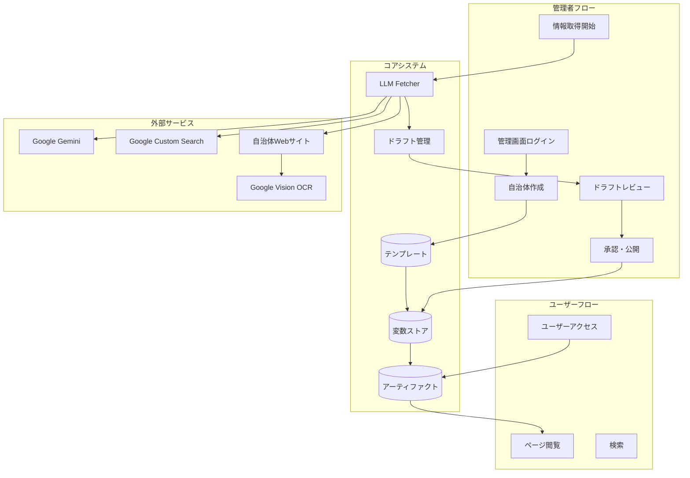

---

## 2. ページレンダリングフロー

### 2.1 GOV.UK方式 URL解決フロー

INNOMAはGOV.UK方式のフラットURLを採用しています。URLとファイル構造が独立しており、
`page-registry.json`でマッピングを管理します。

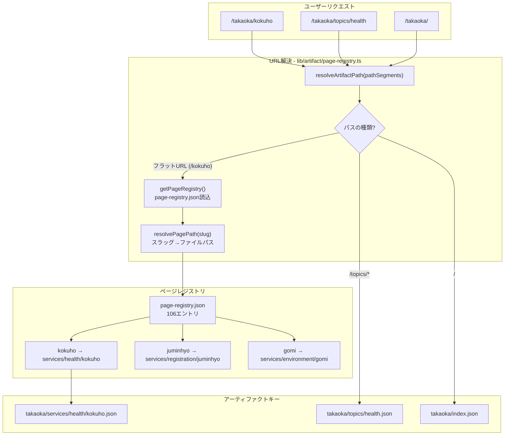

**URL構造の比較:**

| パターン | 旧URL | 新URL (GOV.UK方式) |
|---------|-------|-------------------|
| Content Item | `/takaoka/services/health/kokuho` | `/takaoka/kokuho` |
| トピックページ | `/takaoka/topics/health` | `/takaoka/topics/health` (変更なし) |
| ホームページ | `/takaoka/` | `/takaoka/` (変更なし) |

### 2.2 メインレンダリングパイプライン

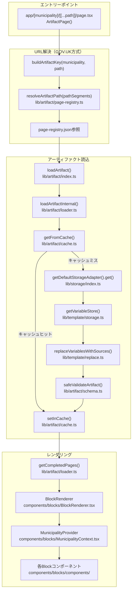

### 2.2 変数置換処理

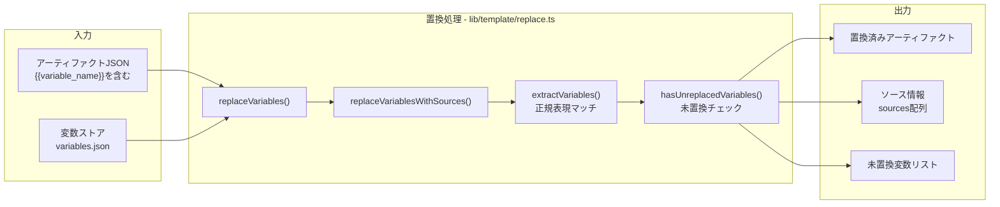

### 2.3 キャッシュ管理

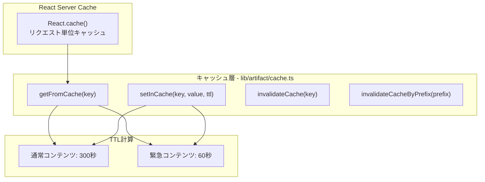

---

## 3. LLM情報取得フロー

### 3.1 メイン取得オーケストレーション

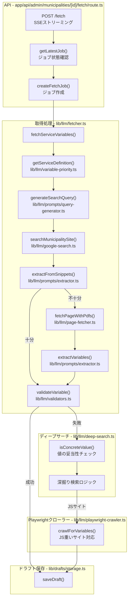

### 3.2 検索処理

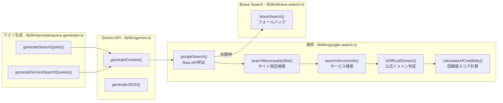

### 3.3 コンテンツ取得・抽出

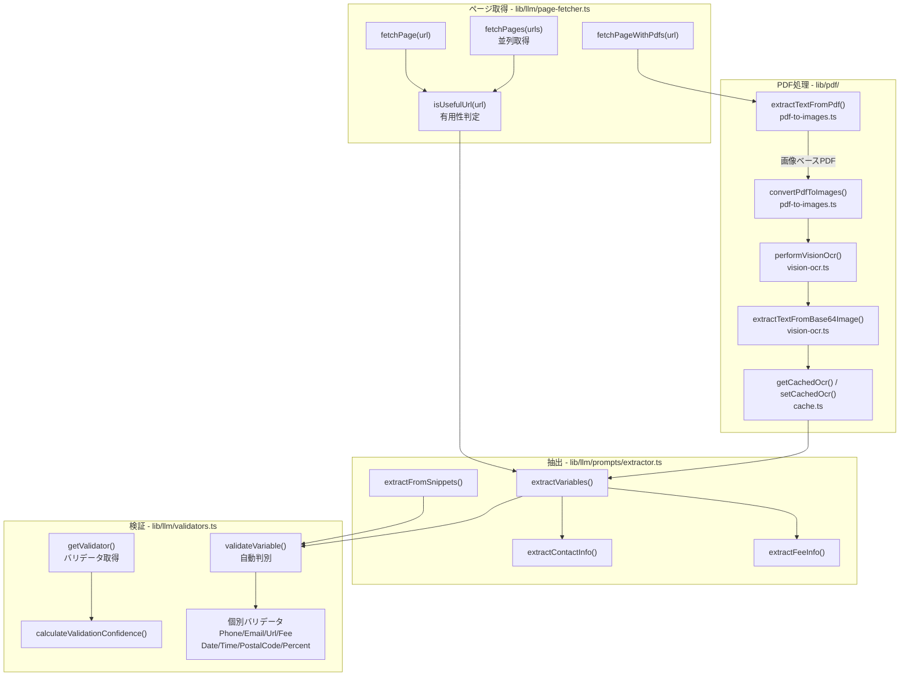

### 3.4 変数定義・優先度

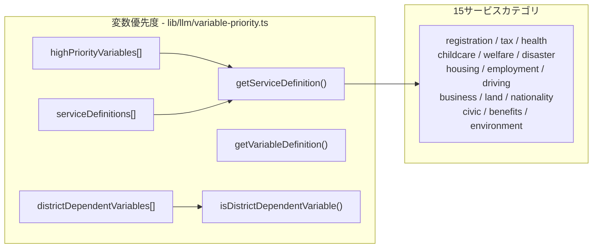

---

## 4. ドラフト管理フロー

### 4.1 ドラフトライフサイクル

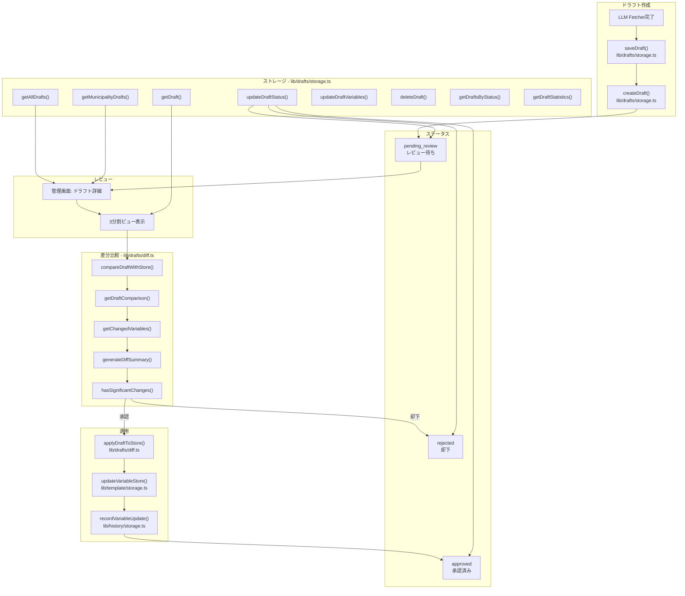

### 4.2 ドラフトデータ構造

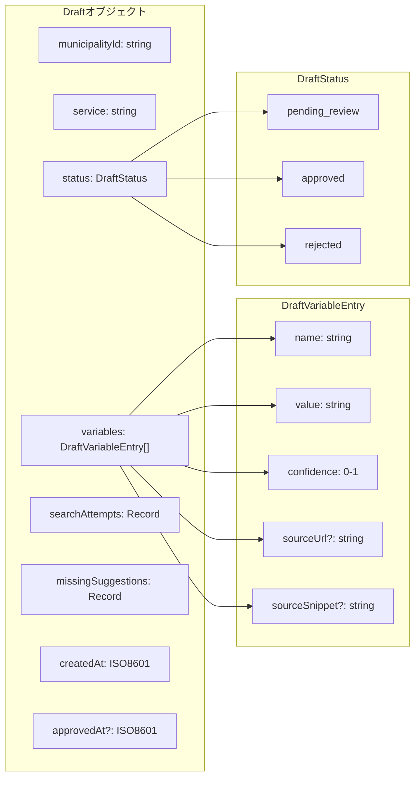

---

## 5. テンプレート・変数システム

### 5.1 ページレジストリ（GOV.UK方式タクソノミー）

URLとコンテンツ分類を分離するため、`page-registry.json`でマッピングを管理します。

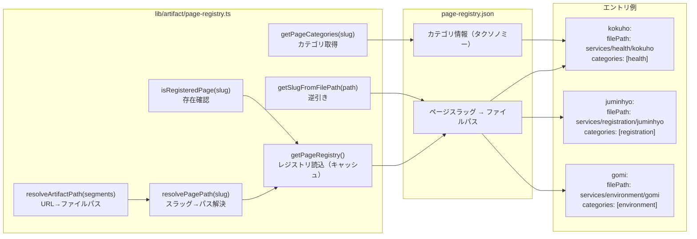

**GOV.UK方式の特徴:**

| 項目 | 説明 |
|------|------|
| **フラットURL** | `/takaoka/kokuho`（階層を含まない） |
| **タクソノミー分離** | URLに分類情報を含めず、メタデータで管理 |
| **複数カテゴリ対応** | 1ページが複数カテゴリに属することが可能 |
| **後方互換性** | 旧形式（`/services/category/page`）もサポート |

### 5.2 テンプレートクローン処理

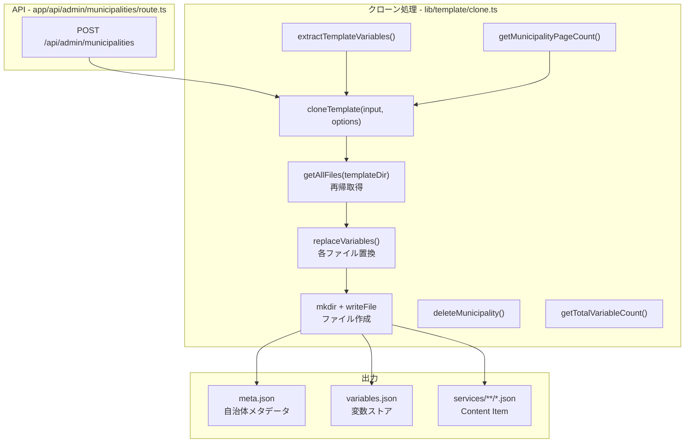

### 5.2 自治体データ管理

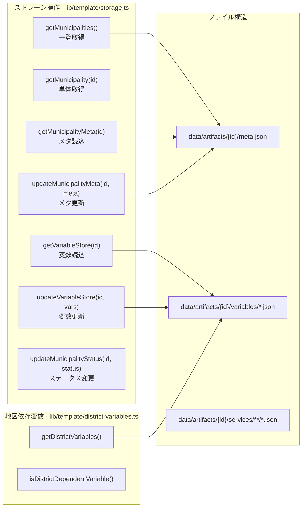

---

## 6. 管理画面フロー

### 6.1 ページ構成

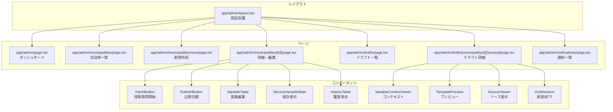

### 6.2 管理API

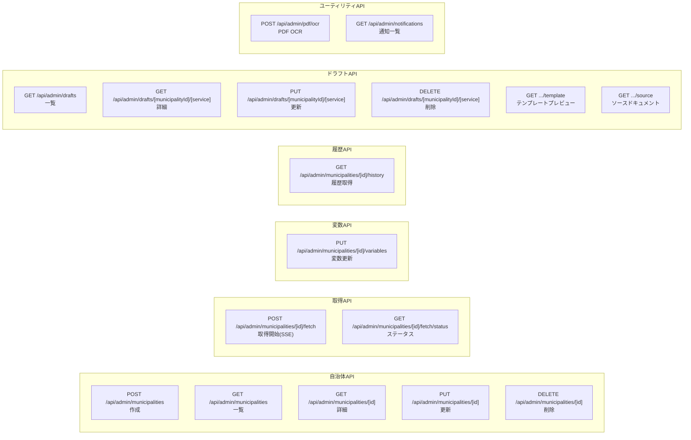

---

## 7. ストレージ抽象化層

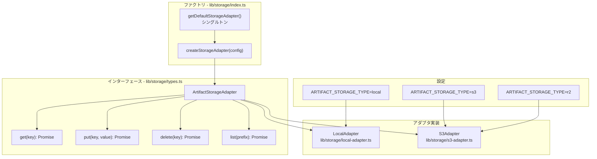

---

## 8. コンポーネント階層

### 8.1 Blockレンダリング

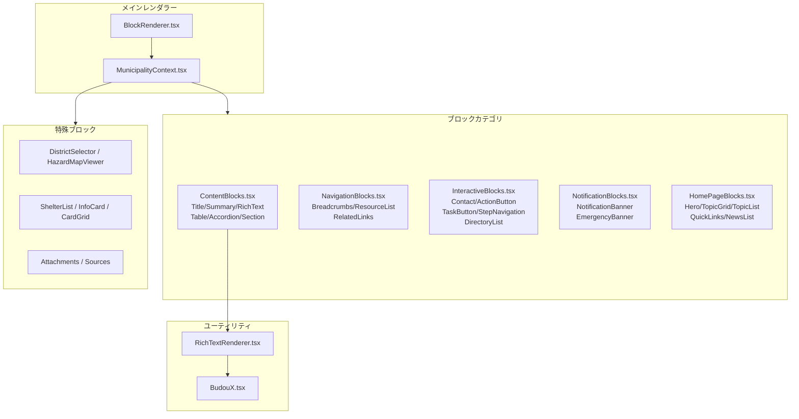

### 8.2 DADSコンポーネント

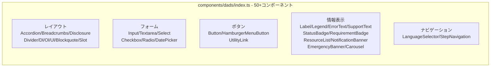

---

## 9. 認証・ミドルウェア

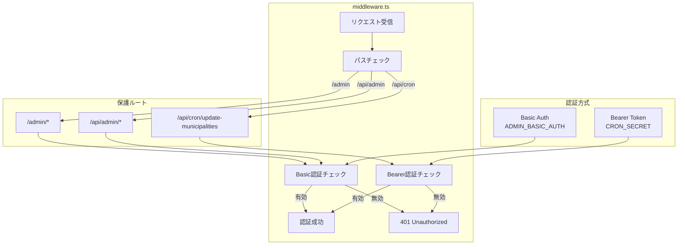

---

## 10. 未使用・参照用コード

### 10.1 アーカイブ（使用禁止）

```mermaid
flowchart LR
    subgraph Archive["archive/ - 使用禁止"]
        A1["archive/docs/<br/>古いドキュメント"]
        A2["archive/scrapers/<br/>旧スクレイピングパイプライン"]
        A3["archive/processors/<br/>旧データ処理"]
    end

    subgraph Warning["警告"]
        W1["CLAUDE.mdで参照禁止"]
        W2["レガシーコード"]
        W3["互換性なし"]
    end

    A1 --> W1
    A2 --> W2
    A3 --> W3
```

### 10.2 開発・テスト用（本番未使用）

| カテゴリ | パス | 用途 |
|---------|------|------|
| 開発ルート | `app/dev/dads/` | DADSコンポーネントショーケース |
| | `app/dev/review/` | コンテンツレビューUI |
| | `app/dev/structure/` | 構造検査 |
| スクリプト | `scripts/test-*.ts` | 各種テストスクリプト |
| | `scripts/validate-artifacts.ts` | スキーマ検証 |
| | `scripts/build-search-index.ts` | 検索インデックス構築 |
| 参照用関数 | `lib/llm/prompts/content-structurer.ts` | COMPONENT_SELECTION_RULES |
| | `lib/llm/prompts/missing-variable-suggester.ts` | 不足変数提案 |

### 10.3 ジョブ管理（内部使用）

| 関数 | 役割 |
|------|------|
| `createFetchJob()` | ジョブ作成 |
| `saveJob()` | 状態保存 |
| `getLatestJob()` | 最新取得 |
| `updateServiceStatus()` | 進捗更新 |
| `recordJobError()` | エラー記録 |
| `completeJob()` | 完了処理 |

- **ストレージ**: `data/artifacts/_jobs/{id}/latest.json`
- **用途**: 長時間実行タスクの再開、進捗トラッキング、エラー復旧

### 10.4 履歴・通知（補助機能）

| モジュール | 関数 | 用途 |
|-----------|------|------|
| `lib/history/storage.ts` | `addHistoryEntry()` | 監査証跡 |
| | `recordVariableUpdate()` | 変更追跡 |
| | `recordBulkVariableUpdate()` | 変更追跡 |
| | `recordDraftApproval()` | 監査証跡 |
| | `recordDraftRejection()` | 監査証跡 |
| | `getHistoryList()` | 監査証跡 |
| | `getHistoryStats()` | 監査証跡 |
| `lib/notification/storage.ts` | `createNotification()` | 管理者通知 |
| | `getNotifications()` | 管理者通知 |
| | `deleteNotification()` | 管理者通知 |

---

## 付録: ファイル一覧と主要エクスポート

### コアライブラリ

| ファイルパス | 主要エクスポート | 役割 |
|-------------|-----------------|------|
| `lib/artifact/index.ts` | `loadArtifact`, `loadArtifacts`, `getCompletedPages` | アーティファクト読込インターフェース |
| `lib/artifact/loader.ts` | `loadArtifactInternal` | キャッシュ付き読込実装 |
| `lib/artifact/schema.ts` | `validateArtifact`, `safeValidateArtifact` | Zodスキーマ検証 |
| `lib/artifact/cache.ts` | `getFromCache`, `setInCache`, `invalidateCache` | インメモリキャッシュ |
| `lib/artifact/page-registry.ts` | `resolveArtifactPath`, `resolvePagePath`, `getPageCategories` | GOV.UK方式URL解決 |
| `lib/template/clone.ts` | `cloneTemplate`, `deleteMunicipality` | テンプレート複製 |
| `lib/template/replace.ts` | `replaceVariables`, `replaceVariablesWithSources` | 変数置換 |
| `lib/template/storage.ts` | `getMunicipalities`, `getVariableStore`, `updateVariableStore` | 自治体データCRUD |
| `lib/llm/fetcher.ts` | `fetchServiceVariables` | LLM取得オーケストレーション |
| `lib/llm/gemini.ts` | `generateContent`, `generateJSON` | Gemini APIクライアント |
| `lib/llm/google-search.ts` | `googleSearch`, `searchMunicipalitySite` | Google検索 |
| `lib/llm/page-fetcher.ts` | `fetchPage`, `fetchPageWithPdfs` | コンテンツ取得 |
| `lib/llm/validators.ts` | `validateVariable`, `validatePhone`, etc. | 値検証 |
| `lib/drafts/storage.ts` | `getAllDrafts`, `getDraft`, `saveDraft` | ドラフトCRUD |
| `lib/drafts/diff.ts` | `compareDraftWithStore`, `applyDraftToStore` | 差分比較・適用 |
| `lib/storage/index.ts` | `createStorageAdapter`, `getDefaultStorageAdapter` | ストレージファクトリ |

### コンポーネント

| ファイルパス | 主要エクスポート | 役割 |
|-------------|-----------------|------|
| `components/blocks/BlockRenderer.tsx` | `BlockRenderer` | ブロック振り分け |
| `components/blocks/MunicipalityContext.tsx` | `MunicipalityProvider`, `useMunicipality` | コンテキスト |
| `components/blocks/RichTextRenderer.tsx` | `RichTextRenderer` | リッチテキスト解析 |
| `components/dads/index.ts` | 50+コンポーネント | DADSライブラリ |

---

*このドキュメントは2026-02-03に更新されました。（GOV.UK方式フラットURL対応を追加）*
